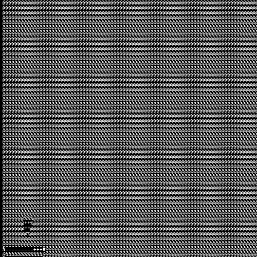

# ASCII Video Player

This is a simple ASCII video player that reads a video file and plays it in the terminal.

## How to use

1. Install ffmpeg
```bash
choco install ffmpeg
```

2. Install the required packages
```bash
pip install -r requirements.txt
```

3. Create a folder called `frames`
```bash
mkdir frames
```

4. Convert the video to frames
```bash
ffmpeg -i sorriso_ronaldo.mp4 -vf scale=100:50,format=gray frames/frame_%04d.png
```

5. Generate the ASCII frames
```bash
python generate_ascii_frames.py
```

6. Play the video
```bash
python ascii_player.py
```

## Arguments

- `--fps` - The frames per second of the video. Default is 30.
- `--memory` - To load all the frames in memory. Default is False.
- `--ascii-dir` - The directory where the ASCII frames are stored. Default is `ascii`.

## Example

```bash
python ascii_player.py --fps 60 --memory --ascii-dir ascii
```

## Demo




